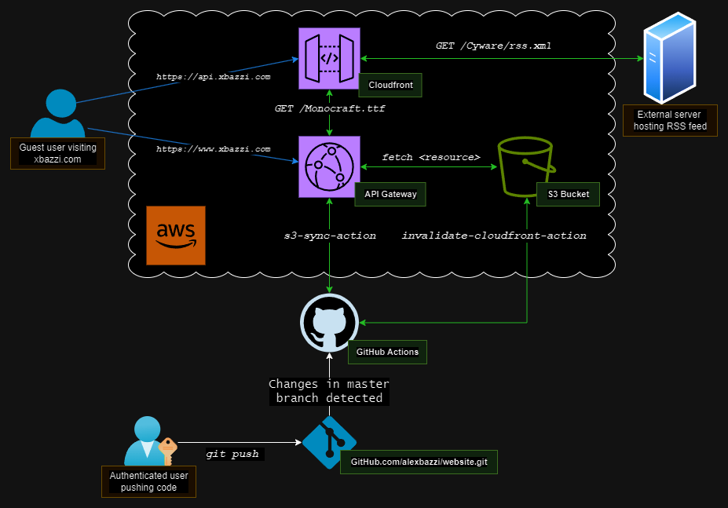

# Personal website
My personal website is a modern homage to the '90s, serving as the dichotomy between the simple aesthetics of retro websites with the unnecessary complexity of the latest DevOps abstractions. The static site is built with Jigsaw, using PHP blade templates for modularity and ease of maintenance.

Hosted on AWS S3 and globally distributed via AWS CloudFront, it ensures fast access anywhere. It also uses a proxy --created with an HTTP AWS API Gateway-- to avoid CORS errors when retrieving resources from other domains (e.g. fonts, RSS feeds, etc...). An automated GitHub Actions workflow keeps the production site updated and manages the CloudFront distribution with every push to the master branch.

Read more about it in the <a href="https://www.xbazzi.com/website.html">article</a>.
